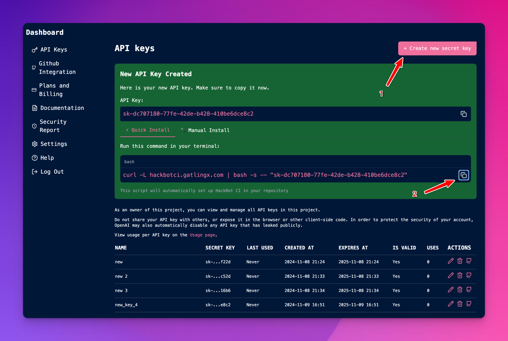

# Quick Start

import Tabs from '@theme/Tabs';
import TabItem from '@theme/TabItem';

:::warning
Hackbot CI is currently in beta. If you encounter any issues, please report them to us on [GitHub issues](https://github.com/GatlingX/hackbot_ci/issues).
:::

## ❗️ Requirements

- Your project must be hosted on GitHub.
- Your project must be a [Foundry project](https://book.getfoundry.sh/). (We will support Hardhat in the future.)
- You must have a `scope.txt` in your project root (recommended), or the `README.md` file needs to explicitly list the scope of the project. (More on this later.)

## Step 1: Create a `scope.txt` file in the project root

This `scope.txt` file on the root of your project is used to tell Hackbot which files to scan. Each line in the file should be a relative path to a file to scan in your repository.


<details>
<summary>Example of `scope.txt`</summary>

<Tabs>
  <TabItem value="scope_txt" label="Image">


  </TabItem>
  <TabItem value="file_structure" label="Text">
```txt title="scope.txt"
./contracts/src/ccip/FeeQuoter.sol
./contracts/src/ccip/MultiAggregateRateLimiter.sol
./contracts/src/ccip/NonceManager.sol

...

./contracts/src/ccip/rmn/RMNHome.sol
./contracts/src/ccip/rmn/RMNRemote.sol
```

  </TabItem>
</Tabs>

For a file structure like this:

```
contracts/ 📁
├── src/ 📁
│   ├── ccip/ 📁
│   │   ├── 📄 FeeQuoter.sol
│   │   ├── 📄 MultiAggregateRateLimiter.sol
│   │   ├── 📄 NonceManager.sol
│   │   ...
│   ├── rmn/ 📁
│   │   ├── 📄 RMNHome.sol
│   │   ├── 📄 RMNRemote.sol
│   ...
📄 foundry.toml
📄 scope.txt
📄 README.md
```

</details>

## Step 2: Get an API key

Go to https://hackbot.co/dashboard/api-keys and click on "Create new secret Key". The website will generate an API key and the one-command installation link. 


<Tabs>
  <TabItem value="website" label="Quick Install">



The website will generate an API key and the one-command installation link. You can see the install script [here](https://github.com/GatlingX/hackbot_ci/blob/main/install.sh).


```bash title="bash"
curl -L hackbotci.gatlingx.com | bash -s -- "<api_key>"
```

The `<api_key>` will be auto-generated by the website. You need to commit the changes to your repository after the installation.


:::warning
Make sure to commit the changes tour repository after the installation.
:::


</TabItem>

<TabItem value="manual" label="Manual">


The website will generate an API key and the one-command installation link. You can see the install script [here](https://github.com/GatlingX/hackbot_ci/blob/main/install.sh).


</TabItem>
</Tabs>


## Step 3: Run the workflow from GitHub

### Option 1: Use the website-automated installation
(TODO: Add instruction for automated install)

### Option 2: Manually add the workflow to your repository

In your github repository, add the following to your `.github/workflows/hackbot.yml` file. Make sure to:
- replace the `{{ secrets.YOUR_API_KEY }}` with your API key.
```yaml title=".github/workflows/hackbot.yml"
name: Hackbot Scan Workflow

on:
  workflow_dispatch:

jobs:
  hackbot-scan:
    runs-on: ubuntu-latest
    permissions:
      contents: read
      issues: write
    steps:
      - name: Checkout repository
        uses: actions/checkout@v4

      - name: Run Hackbot Scan
        uses: GatlingX/hackbot_ci@latest
        with:
          api_key: "{{ secrets.YOUR_API_KEY }}"
          output: "results.json"
          artifact: true
          generate_issues: false
        id: hackbot-action

      - name: Print output
        run: |
          echo "Hack result: ${{ steps.hackbot-action.outputs.results }}"

```


