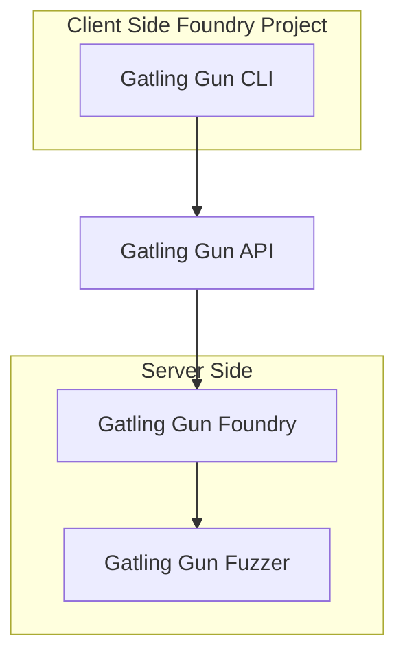

# Welcome to the GatlingX Hackbot CI Documentation!

GatlingX Hackbot is still in early beta. There may be some stability issues and changes to the product.

This documentation provides a comprehensive guide for using the GatlingX Hackbot CI to integrate to your solidity projects.

## Overview

The Hackbot CI works with any [Foundry](https://book.getfoundry.sh/forge/) project, a command-line tool that tests, builds, and deploys your solidity-based smart contracts. 


## 🚀 Quick Start

```sh test copy


```


### How does it work?



## 🔑 Get API Key

To get started, you need to sign up on [GatlingX Hackbot](https://hackbot.org) and get an API key.

